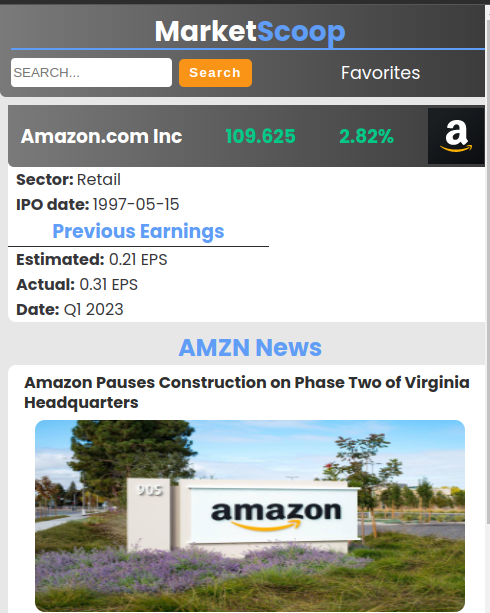

# Market Scoop

## Get the latest market news, live stock prices, and create your favorites list

This project uses free public REST API's to fetch the latest market data.

- Get the latest news on the home page
- Search individual tickers for prices and news related to that particular stock
- Create a favorites list which stores your preferences with local storage

## Watch the full series!

## How to use or install this project

You can use the link on my github pages to use my project as is or if you would like to make any changes, follow these steps below.

1. clone this project
2. run `npm install` to download the necessary dependencies 
3. run `npm run start` to run it on your local server

## Where to get your API Key
This project uses a free API key in which you can get your own at their website if you choose to create your own project. `https://finnhub.io/`

## Known issues 

1. Since I am using a free API that I did not create, sometimes the news articles that are fetched do not have images with them and will not populate. You will see a message that says `user uploaded content` in place of that
2. (In progress) When adding a stock to your favorites, the star will not fill up in color in the search bar but instead I have a message populating stating your stock has been added to your favorites. The star will be filled when you go to your favorites page.